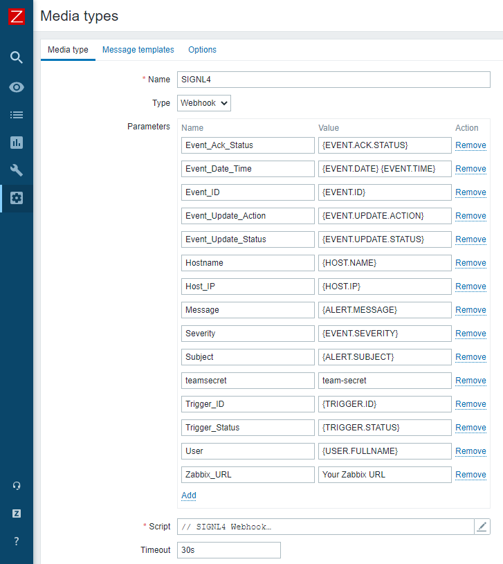

# SIGNL4 Integration for Zabbix

## Why SIGNL4

When critical systems fail, SIGNL4 is the fastest way to alert your staff, engineers, IT admins on call and "in the field". SIGNL4 provides reliable notifications via mobile app push, text and voice calls with tracking, escalations and duty scheduling. Discover how to integrate with Zabbix 5.0 and get the SIGNL4 app at https://www.signl4.com.

Pairing Zabbix with SIGNL4 can enhance your daily operations with an extension to your team wherever it is. The two-way integration allows service engineers or IT administrators not only to receive alerts but also to acknowledge, annotate and close alerts, no matter where they are.


## Setup

There are two options to integrate SIGNL4 with Zabbix.

1. Webhook  
If you use Zabbix 4.4 or higher the webhook is the recommended option. Since Zabbix version 5.0 SIGNL4 is available as a media type by default.

2. Script  
If you are using a Zabbix version lower than 4.4 you the script integration is for you.

## Webhook Integraion

This section describes the setup and configuration of the SIGNL4 webhook for Zabbix:

1. Get SIGNL4  
If not already done, sign up for your SIGNL4 account at https://www.signl4.com or directly from within your SIGNL4 app you can download from the Play Store or App Store.

2. Get the Webhook XML  
If you use Zabbix 5.0 hor higher, SIGNL4 is already available as a mediatype by default. Otherwise you can get the XML file (zabbix-signl4.xml) for Zabbix from Git (https://git.zabbix.com/projects/ZBX/repos/zabbix/browse/templates/media/signl4).

3. Import and Configure the Media Type  
In the SIGNL4 media type you just need to configure the parameter "teamsecret". This is the team secret of your SIGNL4 team. This is the last part of your webhook URL: https://connect.signl4.com/webhook/<team-secret>.
If you use a Zabbix version lower than 5.0 can now import a new Media Type under Administration -> Media types -> Import. Select the file zabbix-signl4.xml here.



4. Add Media Type to User  
Under Administration -> Users, create a dedicated user and add the media type we have created above. In the "Sent to" field you can also use your SIGNL4 team secret.


Please note that this user represents your SIGNL4 team, so it is more a team than a single user in this case.

5. Configure Two-Way Integration  
In addition it is possible to acknowledge, annotate and close alerts from SIGNL4. To forward this information back to Zabbix, you need to configure the Zabbix connector in your SIGNL4 portal under Apps. Here you need to configure the Zabbix username and password as well as the public Zabbix URL rechable from the Internet.

6. Create an Action  
Under Configuration -> Actions you can create an Action that will send the notification to the SIGNL4 user.


6. Test it  
Now you can trigger a problem that will call the above action to then send the alert notification to your SIGNL4 user.

You can find the package in Git: https://git.zabbix.com/projects/ZBX/repos/zabbix/browse/templates/media/signl4

You can find the information and packages for older Zabbix versions on GitHub:
https://github.com/signl4/signl4-integration-zabbix


## Script Integration

In the following we describe the setup and configuration of the SIGNL4 script for Zabbix:

1. Get SIGNL4  
If not already done, sign up for your SIGNL4 account at https://www.signl4.com or directly from within your SIGNL4 app you can download from the Play Store or App Store.

2. Get the Python Script  
Get the Python script (zabbix-signl4.py) for Zabbix from GitHub (https://github.com/signl4/signl4-integration-zabbix).
Copy the script here: usr/lib/zabbix/alertscripts/zabbix-signl4.py and give execution rights to the script.
The python script is called be Zabbix in the following way:
```
python3 zabbix-signl4.py teamsecret subject message
```
Example:
```
python3 zabbix-signl4.py 'xxxxxxxx' 'New Alert from Zabbix' 'Alert message.'
```

3. Create a Media Type  
In Zabbix you can now create a new Media Type under Administration -> Media types -> Create media type.
Name: SIGNL4 Script
Type: Script
Script: zabbix-signl4.py
Script parameters: {ALERT.SENDTO}, {ALERT.SUBJECT}, {ALERT.MESSAGE}


4. Add Media Type to User  
Under Administration -> Users, create a dedicated user and add the media type we have created above.
Sent to: This is the team secret of your SIGNL4 team. This is the last part of your webhook URL: https://connect.signl4.com/webhook/<team-secret>.


Please note that this user represents your SIGNL4 team, so it is more a team than a single user in this case.

5. Create an Action  
Under Configuration -> Actions you can create an Action that will send the notification to the SIGNL4 user.


6. Test it  
Now you can trigger a problem that will call the above action to then send the alert notification to your SIGNL4 user.

You can find the package on GitHub:
https://github.com/signl4/signl4-integration-zabbix
